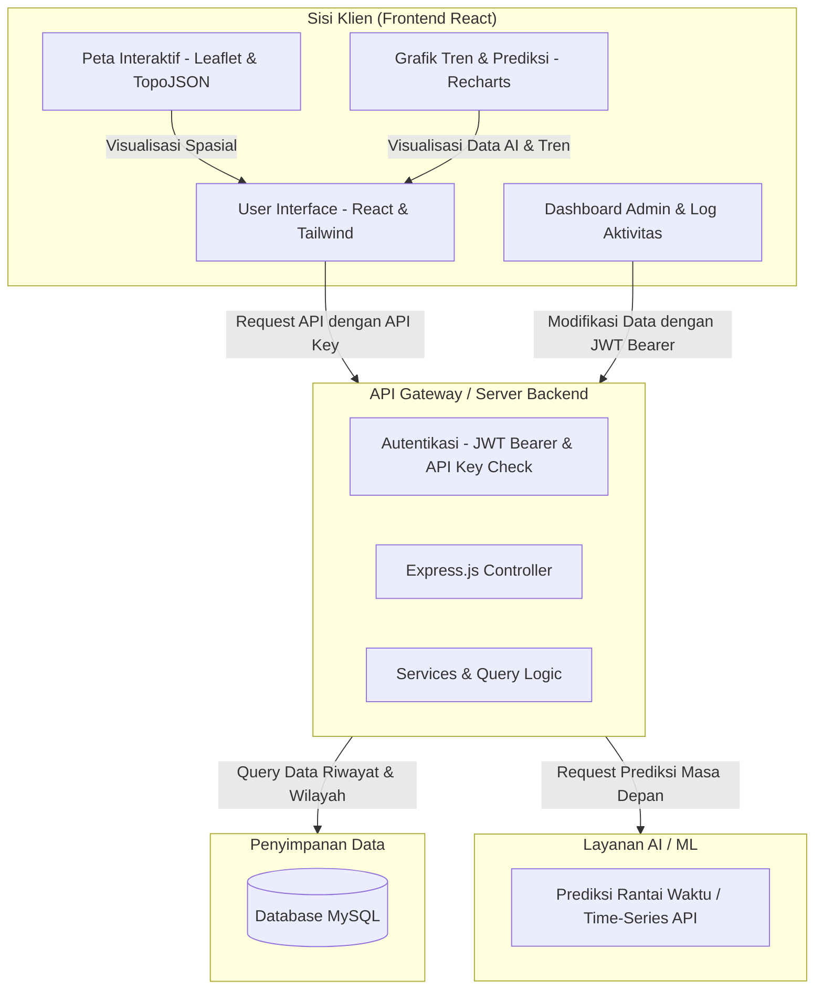

# 🥗 SIPANGAN (Sistem Informasi & Analisis Ketahanan Pangan) — Frontend

[](https://react.dev/)
[](https://vitejs.dev/)
[](https://tailwindcss.com/)
[](https://leafletjs.com/)
[](https://framer.com/motion/)
[](https://vite-pwa-org.netlify.app/)
[](https://opensource.org/licenses/MIT)

**SIPANGAN** adalah platform analitik cerdas berbasis spasial (GIS) dan AI (Artificial Intelligence) yang dirancang khusus untuk memantau stabilitas harga komoditas pangan, memetakan surplus/defisit pasokan, serta memproyeksikan pergerakan harga pangan di masa depan secara real-time. Proyek ini dikembangkan oleh tim pengembang **S26** sebagai wujud kontribusi teknologi untuk memperkuat ketahanan pangan nasional dan mencegah gejolak inflasi daerah, dengan visualisasi pre-konfigurasi untuk wilayah **Jawa Timur**.


---

## 📌 Daftar Isi

- [✨ Fitur Utama](#-fitur-utama)
- [🛠️ Teknologi & Pustaka Utama](#%EF%B8%8F-teknologi--pustaka-utama)
- [📐 Arsitektur Sistem & Aliran Data](#-arsitektur-sistem--aliran-data)
- [📁 Struktur Folder Proyek](#-struktur-folder-proyek)
- [🚀 Panduan Instalasi & Penggunaan Lokal](#-panduan-instalasi--penggunaan-lokal)
- [⚙️ Konfigurasi Environment Variables](#%EF%B8%8F-konfigurasi-environment-variables)
- [🔒 Keamanan & Integrasi API](#-keamanan--integrasi-api)
- [👥 Tim Pengembang (S26)](#-tim-pengembang-s26)
- [📄 Lisensi](#-lisensi)

---

## ✨ Fitur Utama

Aplikasi web SIPANGAN Frontend memiliki serangkaian fitur mutakhir yang dirancang interaktif, dinamis, dan responsif:

### 1. 🗺️ Geospatial Market Intelligence (Peta Interaktif)
Visualisasi spasial berbasis peta **Choropleth** (Leaflet & TopoJSON) yang memetakan disparitas harga secara geografis di 38 kabupaten/kota Jawa Timur secara instan.
*   **Color-Graded Mapping**: Warna wilayah berubah secara dinamis berdasarkan tingkat harga komoditas terpilih.
*   **Weather Integration Widget**: Dilengkapi widget informasi cuaca lokal terkini karena kondisi cuaca berdampak langsung terhadap hasil panen dan distribusi logistik.
*   **Komparasi Spasial**: Fitur multi-pemilihan wilayah untuk membandingkan matriks harga antar kabupaten/kota secara langsung.

### 2. 🔮 AI Predictive Analytics & Tren Harga (Recharts)
Penyajian data historis dan proyeksi pergerakan harga komoditas pangan di masa depan menggunakan grafik interaktif yang menawan.
*   **Time-Series Visualization**: Grafik performa tinggi dari Recharts untuk menganalisis data tren bulanan dan tahunan.
*   **ML Forecasting Integration**: Menampilkan estimasi harga komoditas untuk bulan berikutnya yang dihasilkan oleh model Machine Learning di backend.

### 3. 🚨 Early Warning System (EWS)
Sistem peringatan dini otomatis untuk mendeteksi gejolak harga yang tidak wajar.
*   **Status Klasifikasi**: Mengategorikan status kerawanan wilayah menjadi **Aman (Hijau)**, **Waspada (Kuning)**, dan **Krisis (Merah)** berdasarkan ambang batas (*threshold*) fluktuasi harga pasar.
*   **Alert Notifications Banner & Marquee**: Informasi harga bergerak (Running Marquee) di halaman utama untuk memantau lonjakan harga secara real-time.

### 4. 🧭 Interactive User Onboarding (React Joyride)
Panduan interaktif virtual (Tour Guide) saat pertama kali pengguna membuka peta untuk membantu mereka memahami fungsionalitas tombol, legenda warna, filter komoditas, dan fitur pencarian.

### 5. 🔒 Dashboard Admin & Audit Trail Komprehensif
Panel khusus yang aman dengan pembatasan hak akses (*Role-based Access Control* - Super Admin & Admin) untuk mengelola data operasional:
*   **Manage Data**: Operasi CRUD (Create, Read, Update, Delete) komoditas pangan dan entri riwayat harga secara manual.
*   **User Management**: Manajemen akun pengguna sistem untuk kolaborator dinas/instansi terkait.
*   **Activity Logs (Audit Trail)**: Pencatatan histori aktivitas krusial admin untuk transparansi tindakan dan keamanan sistem.

### 6. 📄 Ekspor PDF Laporan Pintar (jsPDF & AutoTable)
Fitur untuk mengunduh laporan analisis pasar dan perbandingan harga dalam format dokumen PDF resmi yang diformat rapi secara otomatis.

---

## 🛠️ Teknologi & Pustaka Utama

Sistem ini didirikan di atas teknologi modern untuk memastikan kecepatan rendering, visualisasi mulus, serta skalabilitas tinggi:

| Kategori | Teknologi/Library | Kegunaan |
| :--- | :--- | :--- |
| **Core & Routing** | React 18, React Router DOM v6 | Library UI utama dan manajemen navigasi SPA (*Single Page Application*). |
| **Build & Tooling** | Vite, PostCSS, ESLint | Build tool super cepat untuk pengembangan dan kompilasi produksi. |
| **Styling & Motion** | Tailwind CSS, Framer Motion | Desain antarmuka responsif yang premium disertai micro-animations interaktif. |
| **Geospatial (GIS)** | Leaflet, React Leaflet, TopoJSON Client | Pemrosesan file peta TopoJSON Jawa Timur dan rendering peta interaktif. |
| **Visualisasi Data** | Recharts, Lucide React | Pembuatan bagan garis/tren serta koleksi ikon modern. |
| **Interactive Tour** | React Joyride | Membuat panduan langkah demi langkah (*walkthrough*) interaktif bagi pengguna baru. |
| **Data Exporting** | jsPDF, jsPDF-AutoTable | Pembangkitan dokumen PDF langsung dari sisi klien (Client-side PDF generator). |
| **PWA Capability** | Vite Plugin PWA | Memungkinkan aplikasi diinstal di perangkat desktop maupun seluler (Installable). |

---

## 📐 Arsitektur Sistem & Aliran Data

Frontend SIPANGAN berinteraksi dengan API Backend yang tersentralisasi untuk menyajikan data yang akurat. Berikut diagram alir sistem secara umum:



---

## 📁 Struktur Folder Proyek

Proyek ini menggunakan pola organisasi berbasis fitur (*feature-based folder structure*) untuk modul peta yang kompleks, serta berbasis halaman untuk modul umum:

```text
📁 FE-SIPANGAN/
├── 📁 public/                 # Aset statis public (favicon, logo, manifest PWA)
├── 📁 src/
│   ├── 📁 api/                # Konfigurasi HTTP Client
│   │   ├── 📄 axiosClient.js  # Interceptor axios untuk penanganan JWT, Token Refresh, & API Key
│   │   └── 📄 services.js     # Definisi pemanggilan layanan endpoint API
│   ├── 📁 assets/             # Aset gambar & ilustrasi lokal
│   ├── 📁 components/         # Komponen global reusable (dropdown, marquee, modal alert)
│   ├── 📁 features/           # Modul fitur kompleks (Geospatial & Map)
│   │   └── 📁 maps/
│   │       ├── 📁 components/ # Komponen spesifik peta (sidebar, modal bandingkan, legenda)
│   │       ├── 📁 hooks/      # Custom hooks pengolahan data peta spasial
│   │       └── 📄 MapComponent.jsx # Wrapper utama komponen Leaflet Map
│   ├── 📁 layouts/            # Layout struktur halaman (PublicLayout & AdminLayout)
│   ├── 📁 pages/              # Halaman-halaman aplikasi
│   │   ├── 📁 admin/          # Fitur & dashboard khusus administrator (CRUD, Logs, Users)
│   │   └── 📁 public/         # Halaman yang dapat diakses publik (Landing, Map, FAQ, Team)
│   ├── 📄 App.jsx             # Pengaturan routing utama (React Router DOM)
│   ├── 📄 index.css           # Konfigurasi Tailwind & Style Global Custom
│   └── 📄 main.jsx            # Entry point utama React
├── 📄 .env.example            # Contoh konfigurasi environment variables
├── 📄 tailwind.config.js      # Konfigurasi utilitas & tema Tailwind CSS
└── 📄 vite.config.js          # Konfigurasi bundler Vite dan Plugin PWA
```

---

## 🚀 Panduan Instalasi & Penggunaan Lokal

Ikuti langkah-langkah di bawah ini untuk menjalankan frontend SIPANGAN di komputer lokal Anda:

### Prerequisites (Prasyarat)
*   Pastikan Anda sudah menginstal **Node.js** (Rekomendasi versi LTS / v18 atau yang lebih baru).
*   **Git** untuk mengkloning repository.

### Langkah 1: Kloning Repository
```bash
git clone https://github.com/panen-predict-hub/FE-SIPANGAN.git
cd FE-SIPANGAN
```

### Langkah 2: Instalasi Dependensi
Jalankan perintah berikut untuk mengunduh semua pustaka yang dibutuhkan:
```bash
npm install
```

### Langkah 3: Konfigurasi Environment Variables
Salin file `.env.example` menjadi `.env` di direktori utama proyek:
```bash
cp .env.example .env
```
Buka file `.env` yang baru dibuat dan isi variabel sesuai dengan konfigurasi API Server Anda (Lihat bagian [Environment Variables](#%EF%B8%8F-konfigurasi-environment-variables) untuk detail lebih lanjut).

### Langkah 4: Jalankan Server Pengembangan (Local Dev)
Untuk menjalankan aplikasi dalam mode pengembangan lokal dengan fitur *Hot Module Replacement* (HMR):
```bash
npm run dev
```
Buka peramban (browser) Anda dan akses alamat yang tertera di terminal, biasanya `http://localhost:5173`.

### Langkah 5: Bangun Versi Produksi (Production Build)
Untuk melakukan kompilasi kode menjadi file statis siap rilis di hosting (Vercel, Netlify, dll.):
```bash
npm run build
```
Hasil build akan tersimpan di dalam folder `/dist`. Anda dapat menguji hasil build secara lokal dengan perintah:
```bash
npm run preview
```

---

## ⚙️ Konfigurasi Environment Variables

Aplikasi ini membutuhkan konfigurasi variabel lingkungan agar dapat berkomunikasi dengan API Backend. Buat file `.env` di folder root dan konfigurasikan variabel berikut:

| Variabel | Tipe Data | Deskripsi | Contoh Nilai |
| :--- | :--- | :--- | :--- |
| `VITE_API_URL` | String (URL) | Base URL API Backend (Sesuai environment). | `http://localhost:3000/api/v1` atau `https://api.sipangan.subly.my.id/api/v1` |
| `VITE_API_KEY` | String | Kunci API Publik untuk autentikasi awal (*Public Access Token*). | `your_secret_production_api_key` |

> [!WARNING]
> Jangan pernah membagikan file `.env` asli Anda ke repositori publik (seperti GitHub). File ini secara default telah ditambahkan di dalam `.gitignore`.

---

## 🔒 Keamanan & Integrasi API

Integrasi API pada SIPANGAN Frontend dirancang dengan standar keamanan tinggi menggunakan pustaka **Axios Interceptors** (`src/api/axiosClient.js`):

1.  **Public API Key Protection**: Setiap request ke API Server secara otomatis menyertakan header `x-api-key` menggunakan nilai dari variabel `VITE_API_KEY`.
2.  **JWT Bearer Auth**: Ketika pengguna berhasil masuk (login) ke dashboard admin, token akses JWT yang diterima akan disimpan dan disematkan secara otomatis pada header `Authorization: Bearer <token>` untuk setiap request modifikasi data.
3.  **Automatic Token Refresh**: Jika Access Token kedaluwarsa (mengembalikan status `401 Unauthorized`), interceptor akan melakukan request pembaruan token menggunakan *Refresh Token* secara mulus di latar belakang (*silent refresh*). Jika proses gagal (misal sesi habis total), sistem akan otomatis menghapus penyimpanan lokal (*clear local storage*) dan mengarahkan pengguna kembali ke halaman `/admin/login` dengan peringatan sesi kedaluwarsa.

---

## 👥 Tim Pengembang (S26)

Aplikasi ini dikembangkan dengan dedikasi penuh oleh tim **S26** dalam program Capstone Project:

*   **Refaldi Julidinsyah** — *Lead Developer / Frontend & GIS Integration* — [GitHub Profile](https://github.com/rfldisyah) | [syahrefaldi@gmail.com](mailto:syahrefaldi@gmail.com)
*   **Labib Abdullah** — *Lead Developer / Backend & Database Management* — [GitHub Profile](https://github.com/LabibAbdullah1) | [labibabdullahhasan@gmail.com](mailto:labibabdullahhasan@gmail.com)


Kami sangat terbuka untuk kolaborasi, feedback, dan perluasan platform untuk mendukung program ketahanan pangan di berbagai provinsi di Indonesia.

---

## 📄 Lisensi

Proyek ini dilisensikan di bawah **MIT License** - lihat file [LICENSE](LICENSE) untuk detail lengkap.

---
<p align="center">
  Disusun dengan 💚 oleh Tim S26 - SIPANGAN 2026.
</p>